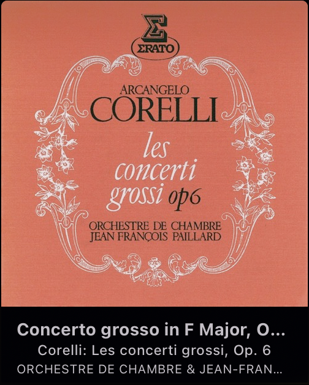

# swinsian-dark-theme-mod
A desktop theme for Swinsian with cover art, artist/album/song, and back/forward/play/pause buttons. The buttons are hidden until you mouseover the cover art.

### Installation
* Download the [latest release]
* Decompress it and add the resulting folder to '~/Library/Application Support/Swinsian/Themes'
* By default cover art is 250x250px. There is also a 150x150px file in the Resources directory. To change it, right click on the theme (com.lojinks.dark-theme-mod.swinsiantheme) and click "Show Package Contents." In the Contents/Resources folder, make a copy of your current index.html and copy index_150.html and then change the filename to index.html. Make sure to keep the original index_150.html and index_250.html so you can switch between them if you like.

### Theme

